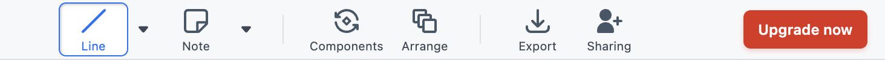
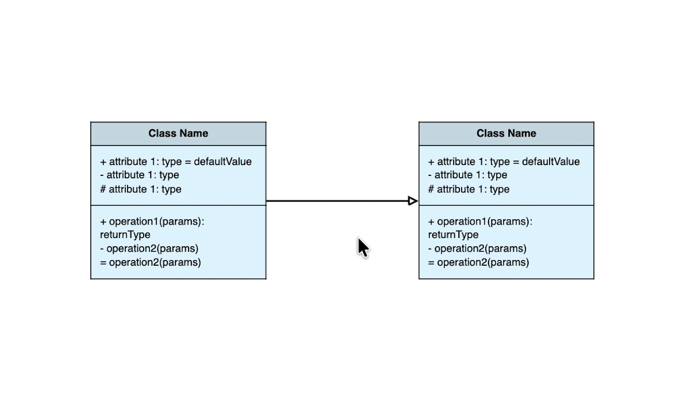

# Connect Classes Using Lines

## Overview

In this section, you will learn how to use lines to connect classes in Moqups.

The section is divided into six main tasks: adding lines, styling lines, changing line paths, modifying connector types, adding text labels, and deleting lines.

By the end of this section, you will be able to connect UML class shapes using lines and customize their appearance and behavior effectively.

!!! note
    In UML diagrams, lines are used to represent relationships between classes, such as association, inheritance, and dependency.

## Add Lines

To add a line between two UML class shapes:

1. **Click** the leftmost [line icon] in the [option menu].

    

2. **Select** [Diagram] from the dropdown menu.
3. **Hover** over the source class until the [blue connection points] appear on its edge.
4. **Click** and **drag** from a [blue connection point] to the edge of the target class.
5. **Release** the mouse when the [blue connection point] on the target class appears.

    

!!! success
    You have successfully connected two UML class shapes with a line.

## Style Lines

In this section, you will learn how to customize the appearance of lines, including changing line color and thickness.

### Change Line Color

To change the color of a line:

1. **Click** on the line to select it.
2. Under [Connector Style], **click** the [color bar].
3. **Choose** a color to change the line color.

    

### Change Line Thickness and Style

To change the thickness and line style of a line:

1. **Click** on the line to select it.
2. Under [Connector Style], **click** the [left dropdown icon] to adjust the thickness.
3. **Click** the [right dropdown icon] to change the line style (e.g., solid, dashed, dotted).

    

!!! note
    Different line styles represent different types of relationships in UML class diagrams:

    - **Solid** — Use for **association**, **aggregation**, and **composition**: relationships where one class is directly and permanently connected to another.
    - **Dashed** — Use for **dependency** and **realization**: relationships where one class only temporarily uses or implements another (e.g., a `User` depends on an `AuthService` to log in).
    - **Dotted** — Use for **interface implementation**: when a class implements an interface contract.

!!! success
    You have successfully styled your line.

## Change Line Paths

To change the path style of a line:

1. **Click** on the line to select it.
2. **Click** on one of the hollow endpoints that appear at either end of the line.
3. **Drag** the hollow endpoint to your desired position.

    

!!! success
    You have successfully changed the path style of your line.

## Modify Connector Types

To change the connector type of a line:

1. **Click** on the line to select it.
2. Under [Connector Style], **click** the third-row middle dropdown to adjust the top/left connector end.
3. **Click** the third-row right dropdown to adjust the down/right connector end.

    

!!! note
    Different connector types represent different UML class relationships:

    - **Diamond (hollow)** — Use for **aggregation**: the child class can exist independently of the parent (e.g., a `Library` has `Books`, but `Books` can exist without the `Library`).
    - **Diamond (filled)** — Use for **composition**: the child class cannot exist without the parent (e.g., a `House` has `Rooms`, and `Rooms` cannot exist without the `House`).
    - **Arrow (open)** — Use for **association**: a general relationship between two classes (e.g., a `Teacher` teaches a `Student`).
    - **Arrow (hollow triangle)** — Use for **inheritance/generalization**: a child class extends a parent class (e.g., `Dog` inherits from `Animal`).
    - **Dashed arrow** — Use for **dependency**: one class temporarily uses another (e.g., a `User` depends on an `AuthService` to log in).

!!! success
    You have successfully modified the connector type of your line.

## Add Text Labels

To add a text label to a line:

1. **Double-click** on the line to select it.
2. **Type** your label text.
3. **Click** outside the line to confirm the label.

    

!!! success
    You have successfully added a text label to your line.

## Delete Lines

To delete a line from your canvas:

1. **Click** to select the line.
2. You will see an [option menu] pop up.
3. **Click** [Delete] from the [option menu].
4. Or press the **Delete** key on your keyboard.

    

!!! success
    You have successfully deleted a line from your canvas.

## Conclusions

By the end of this section, you have learned how to connect UML class shapes using lines in Moqups, including how to add, style, modify, label, and delete lines. These skills will help you represent class relationships clearly in your UML diagrams.
