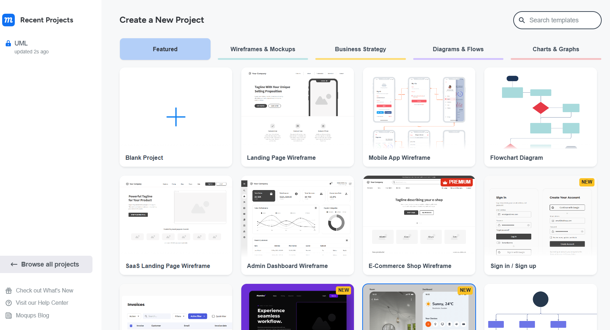
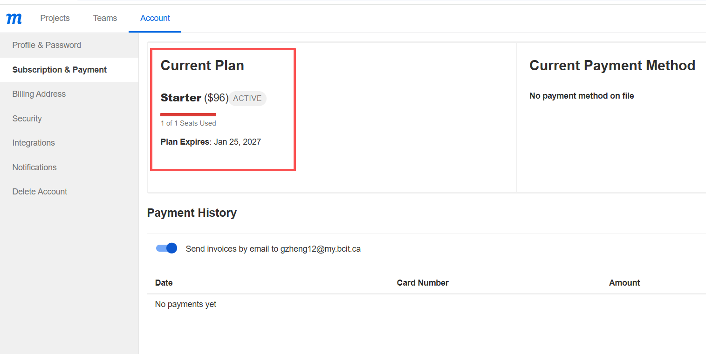

# Create an Account

## Overview

This section explains how to create a Moqups account so you can access the workspace and start building UML Class Diagrams.

## Instructions

You need to create an account before using Moqups. The following steps will guide you through the registration process.

1. Open the Moqups website

    **Open** the [Moqups](https://moqups.com/) homepage and **click** [Sign up] in the top-right corner or [Sign up for free] on the main page.

    

2. Enter your account information

    On the sign-up page, **enter** your email address and password.

    Because you are a BCIT student, it is recommended to register using your myBCIT email, as it can be used to request an educational account upgrade.

    Once you have entered all the required information correctly, **click** [Create Account] to complete the registration.

    !!! note
        Free accounts have limitations. BCIT students can use their myBCIT email to request an educational account upgrade.  
        See [Upgrade to a Student Plan](#upgrade-to-a-student-plan-optional) for more details.

    !!! warning
        Make sure you enter a valid email address so you can access your account later.
    

    !!! note
        You can also sign up using your Google or Microsoft account.

3. Access the workspace

    After creating your account, you will be redirected to the Moqups workspace.

    

    !!! success
        Congratulations! You have successfully created a Moqups account and accessed the workspace.

## Upgrade to a Student Plan (Optional)

BCIT students can request a free upgrade to the Moqups Starter plan for educational use.

1. Open the support page

    On the Moqups homepage, **scroll down** to the bottom of the page.

    Under the [Support] section, **click** [Contact Support].

    

2. Submit a request

    On the contact form page, **enter** your information:

    - Email address (use your myBCIT email)
    - Request type (e.g., Education & Nonprofits)
    - Message (request an educational account upgrade)

    Then **click** [Submit request].

    

3. Wait for confirmation

    After submitting your request, the Moqups support team will review it.
    
    !!! note
        The upgrade is typically processed within 1–2 business days.

    

    !!! success
        Once approved, your account will be upgraded to the Starter plan for educational use.