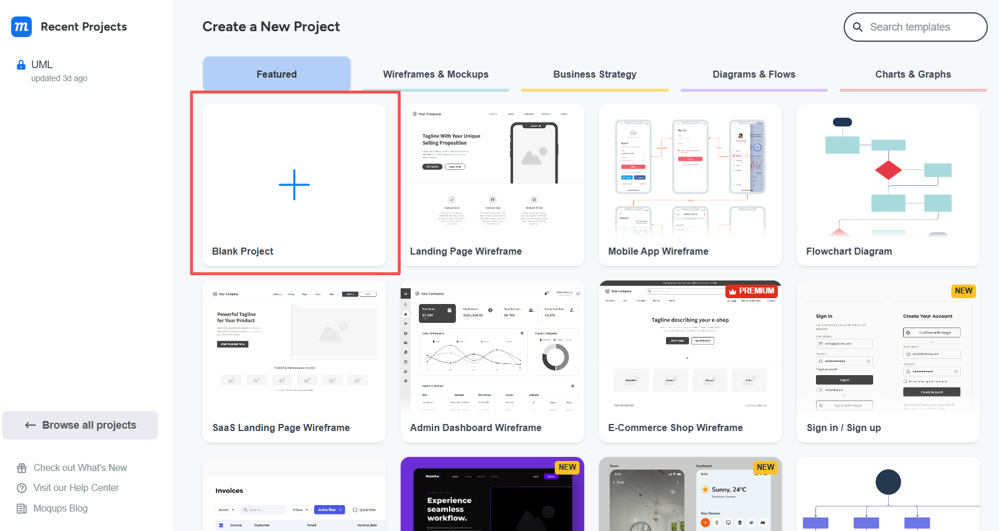
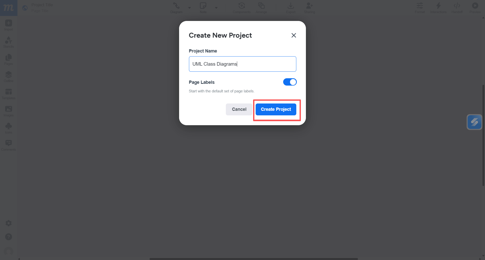
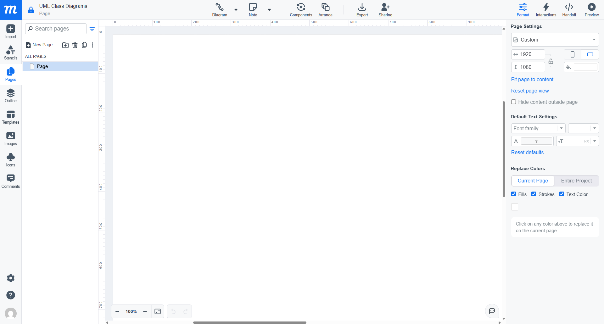
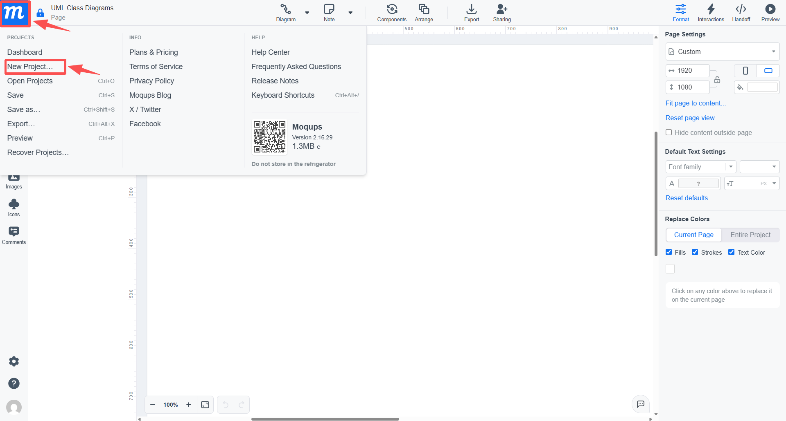

# General Operations

## Overview

This section explains the basic operations needed to start and manage a UML Class Diagram in Moqups. You will learn how to create a diagram, share it with others, and export it for submission or review.

### Create a Document

Before building a UML Class Diagram, you need to create a new project in Moqups.

1. Click the [+] button to create a new project.

2. In the "Create New Project" window, enter a project name (e.g., "UML Class Diagram").

3. Click [Create Project] to open the workspace.

!!! success
    You have now successfully created a blank diagram.

!!! note
    You can also create a new project by clicking the Moqups logo in the top-left corner and selecting [New Project] from the dropdown menu.
    
