# General Operations

## Overview

This section explains the basic operations needed to start and manage a UML Class Diagram in Moqups. You will learn how to create a diagram, share it with others, and export it for submission or review.

## Create a Document

Before building a UML Class Diagram, you need to create a new project in Moqups.

1. Click the [+] button to create a new project.

    

2. Enter a project name (e.g., "UML Class Diagram") in the "Create New Project" window.

    

3. Click [Create Project] to open the workspace.

    

    !!! success
        You have now successfully created a blank diagram.

    !!! note
        You can also create a new project by clicking the Moqups logo in the top-left corner and selecting [New Project] from the dropdown menu.
        

## Share a Document

You can share your UML Class Diagram with classmates or instructors for collaboration or feedback.

To open the sharing panel:

1. Click [Sharing] in the top menu or use the shortcut (Ctrl + Alt + E)

    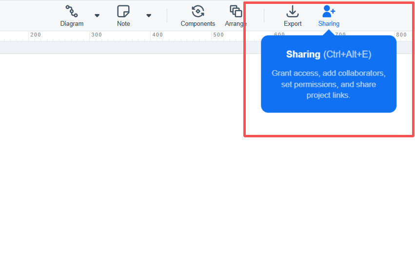

2. There are two common ways to share your document.

### Option 1: Sharing via a link

You can generate a shareable link and send it to others.

1. Locate the project link section in the "Share with Others" window.
2. Click [Copy link].
3. Send the link to others.

    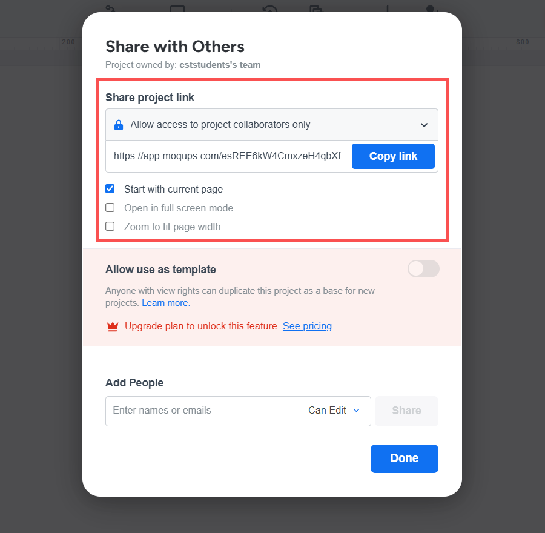

    !!! note
        "Anyone with the link can view" allows anyone with the link to access the UML Class Diagram.  
        "Allow access to project collaborators only" restricts access to invited users only (added through email).

        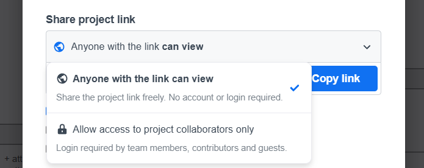

### Option 2: Sharing via email

You can invite specific users by email.

1. In the "Add People" section, enter the email address.
2. Choose a permission level (e.g., Can Edit or Can Comment).
3. Click [Share].

    !!! note
        "Can Edit" allows users to modify the UML Class Diagram, while "Can Comment" only allows feedback.

    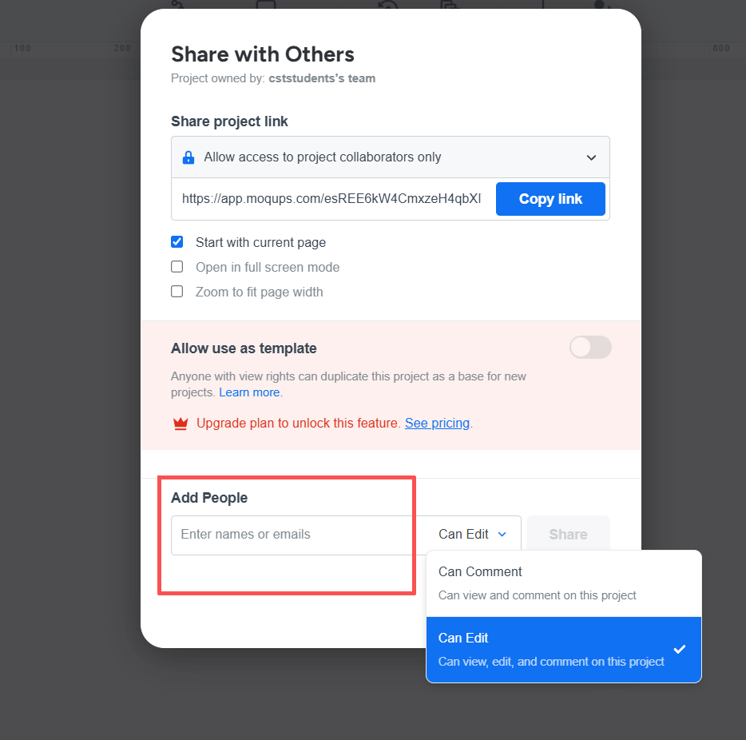
4. After sending the invitation, the added user will appear in the collaborators list with the assigned permission.
    
    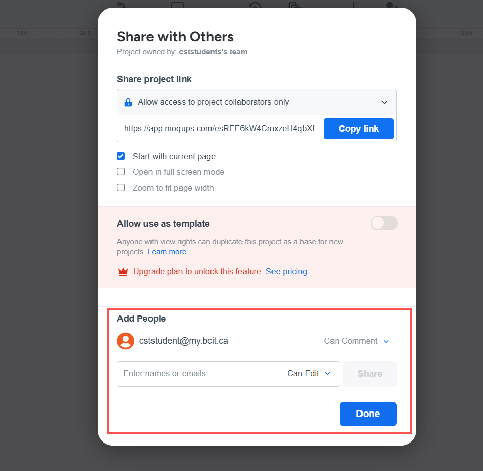

    !!! success
        The document has been successfully shared with the selected user.

    !!! note
        After adding a collaborator, you can change their permission level (e.g., Can Edit or Can Comment) or remove them from the project.

        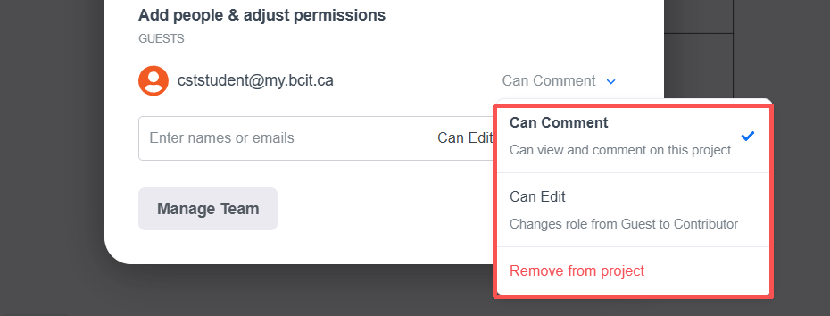

## Export a Document

After completing your UML Class Diagram, you can export it for submission, printing, or sharing.

There are multiple ways to open the export menu:

1. Click [Export] in the top menu.  
2. Click the Moqups logo in the top-left corner and select [Export] from the main menu.  
3. Use the shortcut (Ctrl + Alt + X).

    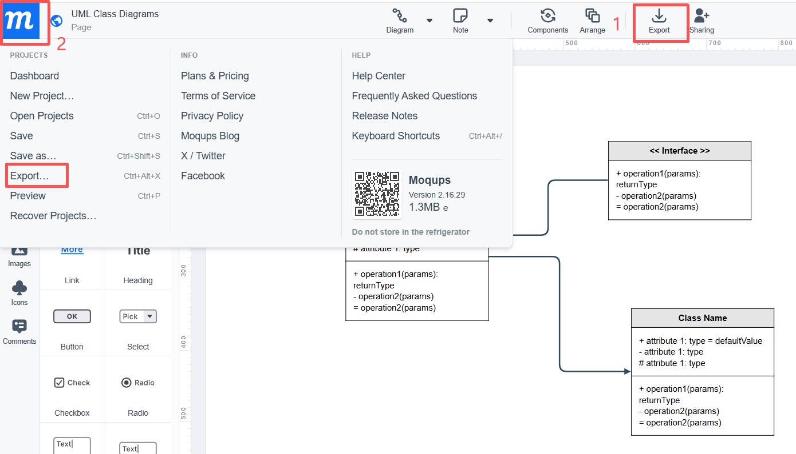

Once the export panel is open, you can choose from different formats:

- **PNG**: Export your UML Class Diagram as an image. This is suitable for quick sharing.

    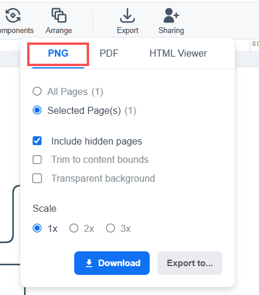

- **PDF**: Export your diagram as a document file. This is recommended for assignment submission.

    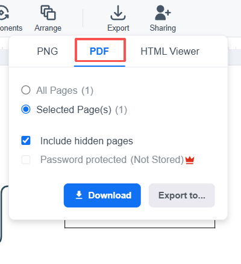

- **HTML Viewer**: Export an interactive version of your diagram for viewing in a browser.

    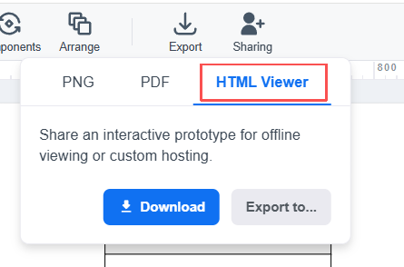

After selecting a format:

1. Choose whether to export all pages or only selected pages.
2. Adjust optional settings if needed (e.g., scale or layout).
3. Click [Download] to save the file.

    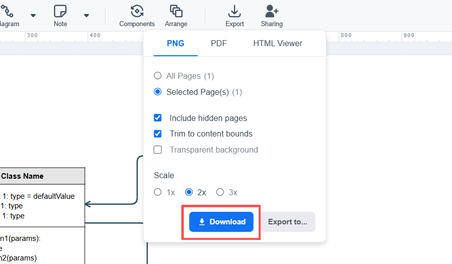

    !!! success
        Your UML Class Diagram has been successfully downloaded to your device.

You can also export your UML Class Diagram to cloud storage services such as Google Drive or Dropbox by selecting [Export to...].
        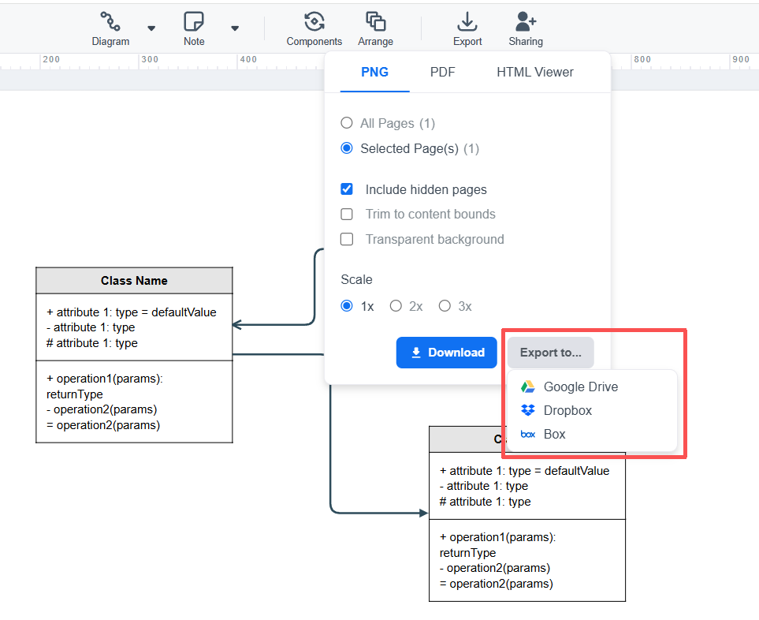

!!! note
    Saving to cloud storage is useful for accessing your UML Class Diagram from different devices or sharing it easily.
    
## Conclusions

By the end of this section, you have learned how to create, share, and export UML Class Diagrams in Moqups. These basic operations will help you manage your work and prepare your diagrams for collaboration and submission.