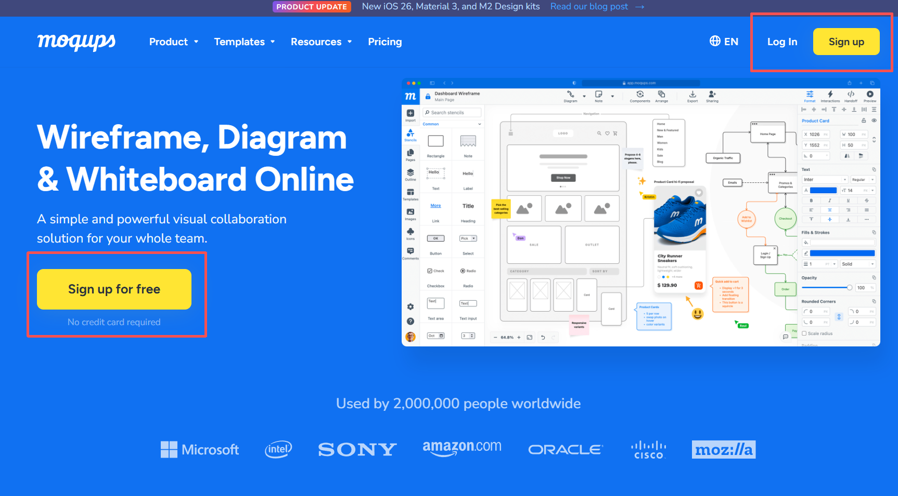
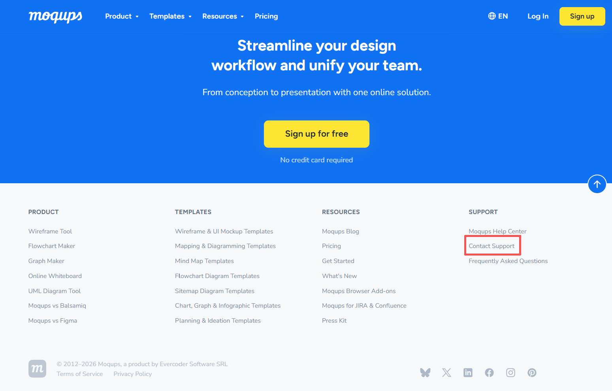
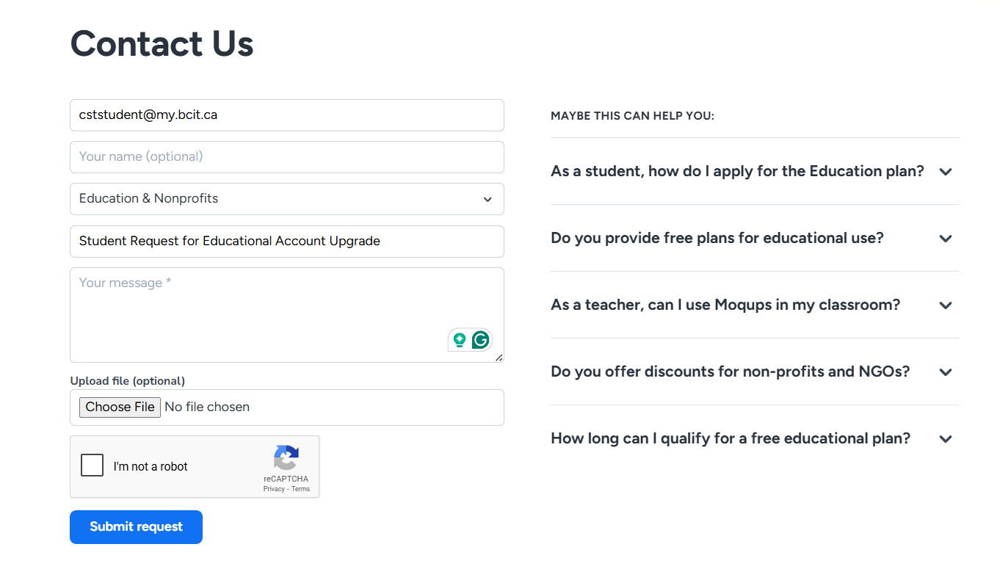

# Home

## Introduction

Welcome! This guide will help you use Moqups to create UML Class Diagrams for system design.

Moqups is a web-based diagramming tool that allows users to create and organize visual diagrams. While it supports various diagram types such as wireframes and flowcharts, this guide focuses specifically on using its tools to construct UML Class Diagrams. Instead of explaining UML theory, this guide emphasizes how to use Moqups features to represent classes and relationships visually.

## Is This Guide for You?

This guide is designed for CST students enrolled in COMP 2522 (Object-Oriented Programming 1). It provides step-by-step instructions on using the most basic tools to build a UML Class Diagram.

## Learning Outcomes

By the end of this guide, you will be able to

* create a Moqups account, 
* perform general operations within the Moqups workspace,   
* create UML classes using shapes, and  
* connect classes using lines to represent relationships.

## Prerequisites

To follow this guide, you will need

* a computer with internet access, 
* a modern web browser (e.g., Google Chrome, Safari, or Firefox),
* a valid email account to create a Moqups account, and
* basic understanding of UML Class Diagram concepts, and
* basic knowledge of using a mouse, keyboard, and trackpad.

## Typographical Conventions

This guide uses the following typographic conventions:

| Convention Explanation                                                                                                            | Examples                                             |
| :-------------------------------------------------------------------------------------------------------------------------------- | :--------------------------------------------------- |
| Commands & Actions: Bolded verbs indicate actions you need to perform when using Moqups.                                          | **Click, Drag, Select, Type, Open**                  |
| Menu & Toolbar Sequence: Menus, panels, or tools are enclosed in square brackets. The → symbol indicates the sequence of actions. | [Dashboard] → [Create New Project] → [Blank Diagram] |

## Admonitions

This guide uses success, warning, and note messages to provide additional information for each step.

!!! success
    Success indicates that a step has been completed correctly. It appears in a green box with a checkmark icon next to the word “Success”.

!!! warning
    Warning highlights actions that may cause errors or issues if performed incorrectly. It appears in an orange box with a warning icon next to the word “Warning”.

!!! note
    Note provides additional tips or helpful information related to a step. It appears in a blue box with a pen icon next to the word “Note”.

## General Operations

### Overview

Moqups is an online diagramming tool that allows users to create and collaborate on professional diagrams such as UMLs.

In this section, you will learn how to create an account and access the Moqups workspace.

## Register an Account

You need to create an account before using Moqups. The following steps will guide you through the registration process.

### Step 1: Open the Moqups website

**Open** the Moqups homepage and **click** [Sign up] in the top-right corner or [Sign up for free] on the main page.

### Step 2: Enter your account information

On the sign-up page, **enter** your email address and password.

If you are a BCIT student, it is recommended to register using your myBCIT email, as it can be used to request an educational account upgrade.

Once you have entered all the required information correctly, **click** [Create Account] to complete the registration.

!!! warning
    Free accounts have limitations. BCIT students can use their myBCIT email to request an educational account upgrade.

!!! warning
    Make sure you enter a valid email address so you can access your account later.

!!! note
    You can also sign up using your Google or Microsoft account.

!!! success
    Congratulations! You have successfully created a Lucidchart account.

## Upgrade to a Student Plan (Optional)

BCIT students can request a free upgrade to the Moqups Starter plan for educational use.

### Step 1: Open the support page

On the Moqups homepage, **scroll down** to the bottom of the page.

Under the [Support] section, **click** [Contact Support].

### Step 2: Submit a request

On the contact form page, **enter** your information:

- Email address (use your myBCIT email)
- Request type (e.g., Education & Nonprofits)
- Message (request an educational account upgrade)

Then **click** [Submit request].

### Step 3: Wait for confirmation

After submitting your request, the Moqups support team will review it.

!!! note
    The upgrade is typically processed within 1–2 business days.

!!! success
    Once approved, your account will be upgraded to the Starter plan for educational use.