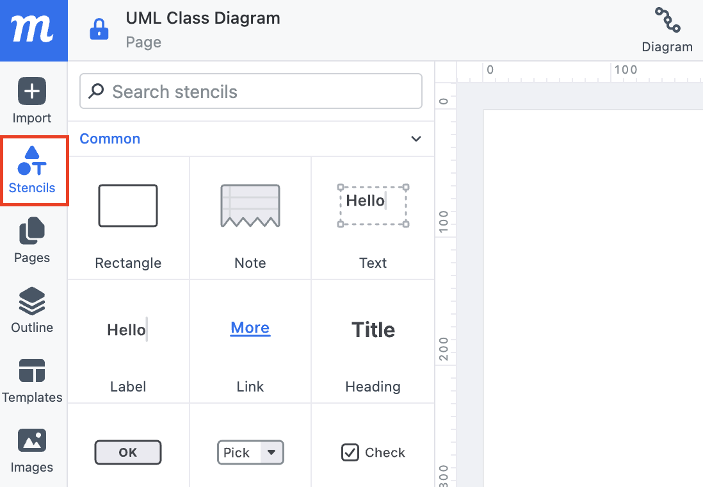

# Work with UML Class Shapes

## Overview

In this section, you will learn how to work with UML class shapes in Moqups.

The section is divided into four main tasks: creating class shapes, editing their appearance, organizing shape layouts, and deleting shapes.

By the end of this section, you will be able to create, organize, and customize UML class shapes effectively.

!!! note
    A UML class represents a blueprint of an object in a system. It defines the structure and behavior of objects by including attributes (data) and methods (functions). 

## Create Class Shapes

To creat a shape to your canvas:

1. **Click** on [Stencils] from the left-side panel, . 

    

2. **Type** “UML” in the [Search Stencils] input box. You will then see the UML Class shape appear in the results.

    
    
3. **Drag** and **drop** the UML class shape onto the canvas.

    

!!! success
    You have successfully added your first UML class shape to the canvas.

## Style Class Shapes

In this section, you will learn how to customize the appearance of UML class shapes, including changing fill color, border style, and text formatting.

### Change Fill Color

To change fill color to your UML shapes:

1. **Click** on the UML class shape.
2. **Click** [paint bucket icon] under [Fills & Strokes],.
3. **Choose** a color to change the background of the shape.

        

### Change Border Style

To change border style to your UML shapes:

1. **Click** on the UML class shape.
2. **Click** [pen icon] under [Fills & Strokes],.
3. **Choose** a color to change the border color of the shape.

        

There is also another way to change border style. In the same [pen settings] section:
1. **Click** the [left dropdown icon] to adjust the border thickness.
2. **Click** the [right dropdown icon] to change the line style (e.g., solid, dashed, dotted).

     

!!! success
    You have successfully customized your UML class shape.

## Organize Shape Layouts

In this section, you will learn how to organize UML class shapes by aligning and grouping multiple shapes for better layout and readability.

### Align Multiple Shapes

To align multiple UML class shapes:

1. **Hold Shift** and **right click** to select multiple UML class shapes. You will see a [option menu] pops up.
2. **Choose** an alignment type from the [option menu].

    

### Group Multiple Shapes

To group multiple UML class shapes:

1. **Hold Shift** and **right click** to select multiple UML class shapes. You will see a [option menu] pops up.
3. **Choose** the [Group icon] from the [option menu].

    

!!! success
    You have successfully organized your UML class shapes using alignment and grouping tools.

## Delete Class Shapes

To delete a shape from your canvas:

1. **Hold Shift** and **click** to select UML class shape. You will see a [option menu] pops up.
2. **Click** [Delete] from the [option menu] or **press** the **Delete** key on your keyboard.

    

!!! success
    You have successfully delete your UML class shapes.

## Conclusions

By the end of this section, you have learned how to work with UML class shapes in Moqups, including how to create, style, organize, and delete shapes. These skills will help you create clear and well-structured UML class diagrams.

